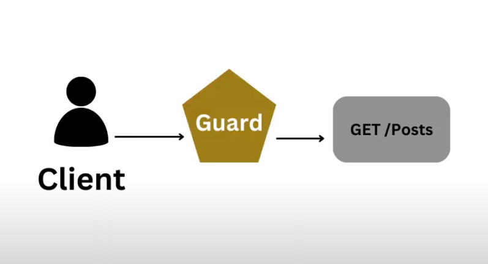

<p align="center">
  
</p>


  <h1 align="center">Security Demo Application with NestJS</h1>
This application is built with NestJS and provides a simple authentication mechanism using JWT (JSON Web Tokens).

## Installation

```bash
$ npm install
```

## Running the app

```bash
# development
$ npm run start

# watch mode
$ npm run start:dev

# production mode
$ npm run start:prod
```

## Install the following packages
````
npm install --save @nestjs/jwt
npm install typeorm
npm install class-validator
npm install @nestjs/typeorm
npm install @nestjs/config
npm install pg --save
npm install dotenv

````

## API Documentation

Click here to see documentation : 
https://documenter.getpostman.com/view/28283365/2sA3XPDNdR


<br>
<br>

 <h1 align="center"> In-Memory User Authentication and Authorization </h1>

## Overview

This project demonstrates a simple in-memory user authentication and authorization system using NestJS. It includes basic endpoints for user login and profile retrieval, with authentication and authorization handled through custom guards and services.

## Endpoints

### `POST /auth/login`
- **Description**: Authenticates a user and returns a JWT token.
- **Body**:
    - `username`: The username of the user trying to log in.
    - `password`: The password of the user trying to log in.
- **Response**: Returns an object containing the JWT token.
- **Example Request**:
  ```json
  {
    "username": "john",
    "password": "changeme"
  }
  ```
- **Example Response**:
  ```json
  {
    "access_token": "jwt-token-string"
  }
  ```

### `GET /auth/profile`
- **Description**: Fetches the profile of the authenticated user.
- **Guards**:
    - `AuthGuard`: Ensures the user is authenticated by validating the JWT token.
- **Response**: Returns the user profile.
- **Example Response**:
  ```json
  {
    "userId": 1,
    "username": "john"
  }
  ```
<br>

## Services and Guards

### `UsersService`
- **Purpose**: Manages user data. In this example, users are stored in-memory.
- **Methods**:
    - `findOne(username: string)`: Finds and returns a user by their username.

### `AuthService`
- **Purpose**: Handles authentication logic, including validating user credentials and generating JWT tokens.
- **Methods**:
    - `signIn(username: string, password: string)`: Authenticates a user and returns a JWT token.

### `AuthGuard`
- **Purpose**: Custom guard that checks if a request is authenticated by validating the JWT token.

<br>

## Setup and Running the Project

1. **Install Dependencies**: Run `npm install` to install the required dependencies.
2. **Environment Variables**: Ensure that the necessary environment variables for JWT secret, etc., are set up. For example, create a `.env` file with the following content:
   ```env
   JWT_SECRET=your_jwt_secret
   ```
3. **Run the Application**: Use `npm run start` to start the NestJS application.
4. **Access the Endpoints**: The API endpoints can be accessed at:
    - `http://localhost:3000/auth/login`
    - `http://localhost:3000/auth/profile`

## Example User Data

The following users are pre-defined in the in-memory storage:

- **User 1**:
    - `userId`: 1
    - `username`: `john`
    - `password`: `changeme`

- **User 2**:
    - `userId`: 2
    - `username`: `maria`
    - `password`: `guess`

<br>

## Example Usage

### Login Request
```bash
curl -X POST http://localhost:3000/auth/login -d '{"username": "john", "password": "changeme"}' -H "Content-Type: application/json"
```

### Profile Request
First, obtain the JWT token from the login request, then use it to access the profile endpoint:
```bash
curl -X GET http://localhost:3000/auth/profile -H "Authorization: Bearer jwt-token-string"
```

## Conclusion

This project provides a basic example of in-memory user authentication and authorization using NestJS. It demonstrates the use of custom guards, services, and controllers to handle authentication and authorization logic. This setup can be extended to include more robust features like database integration, role-based access control, and more.

<br>
<br>


 <h1 align="center"> Security with JWT and Database Integration </h1>

## EmployeeController Endpoints

### `POST /employee/getAll`
- **Description**: Fetches all employees.
- **Guards**:
    - `AuthDbGuard`: Ensures the user is authenticated.
    - `RolesGuard`: Ensures the user has the required roles.
- **Roles**: Only accessible by users with the `ADMIN` role.
- **Response**: Returns a list of `Employee` objects.

### `POST /employee/get`
- **Description**: Fetches an employee by their ID.
- **Body**:
    - `id`: The ID of the employee to fetch.
- **Guards**:
    - `AuthDbGuard`: Ensures the user is authenticated.
    - `RolesGuard`: Ensures the user has the required roles.
- **Roles**: Only accessible by users with the `USER` role.
- **Response**: Returns an `Employee` object.

### `POST /employee/create`
- **Description**: Creates a new employee.
- **Body**:
    - `employeeDto`: The details of the employee to create (DTO).
- **Guards**:
    - `AuthDbGuard`: Ensures the user is authenticated.
    - `RolesGuard`: Ensures the user has the required roles.
- **Roles**: Only accessible by users with the `ADMIN` role.
- **Response**: Returns the created `Employee` object.

### `POST /employee/update`
- **Description**: Updates an existing employee.
- **Body**:
    - `id`: The ID of the employee to update.
    - `employeeDto`: The new details of the employee (DTO).
- **Guards**:
    - `AuthDbGuard`: Ensures the user is authenticated.
    - `RolesGuard`: Ensures the user has the required roles.
- **Roles**: Only accessible by users with the `ADMIN` role.
- **Response**: Returns the updated `Employee` object.

### `POST /employee/delete`
- **Description**: Deletes an employee by their ID.
- **Body**:
    - `id`: The ID of the employee to delete.
- **Guards**:
    - `AuthDbGuard`: Ensures the user is authenticated.
    - `RolesGuard`: Ensures the user has the required roles.
- **Roles**: Only accessible by users with the `ADMIN` role.
- **Response**: Returns a message confirming the deletion.

---
<br>

## MemberController Endpoints

### `POST /member/create`
- **Description**: Creates a new member.
- **Body**:
    - `memberDto`: The details of the member to create (DTO).
- **Response**: Returns the created `Member` object.

### `POST /member/getAll`
- **Description**: Fetches all members.
- **Guards**:
    - `AuthDbGuard`: Ensures the user is authenticated.
- **Response**: Returns a list of `Member` objects.

### `POST /member/get`
- **Description**: Fetches a member by their ID.
- **Body**:
    - `id`: The ID of the member to fetch.
- **Guards**:
    - `AuthDbGuard`: Ensures the user is authenticated.
    - `RolesGuard`: Ensures the user has the required roles.
- **Roles**: Only accessible by users with the `ADMIN` role.
- **Response**: Returns a `Member` object.

### `POST /member/getByUsername`
- **Description**: Fetches a member by their username.
- **Body**:
    - `username`: The username of the member to fetch.
- **Guards**:
    - `AuthDbGuard`: Ensures the user is authenticated.
- **Response**: Returns a `Member` object.

### `POST /member/update`
- **Description**: Updates an existing member.
- **Body**:
    - `id`: The ID of the member to update.
    - `memberDto`: The new details of the member (DTO).
- **Guards**:
    - `AuthDbGuard`: Ensures the user is authenticated.
- **Response**: Returns the updated `Member` object.

### `POST /member/delete`
- **Description**: Deletes a member by their ID.
- **Body**:
    - `id`: The ID of the member to delete.
- **Guards**:
    - `AuthDbGuard`: Ensures the user is authenticated.
    - `RolesGuard`: Ensures the user has the required roles.
- **Roles**: Only accessible by users with the `ADMIN` role.
- **Response**: Returns a message confirming the deletion.

---
<br>

## AuthDbController Endpoints

### `POST /auth-db/login`
- **Description**: Authenticates a user and returns a JWT token.
- **Body**:
    - `username`: The username of the user trying to log in.
    - `password`: The password of the user trying to log in.
- **Response**: Returns an object containing the JWT token.

## Guards and Roles

### `AuthDbGuard`
- **Purpose**: Ensures the user is authenticated by checking the presence and validity of a JWT token.

### `RolesGuard`
- **Purpose**: Ensures the user has the required roles to access a specific endpoint. Works in conjunction with the `@Roles` decorator.

### `@Roles` Decorator
- **Purpose**: Specifies the roles required to access a specific endpoint. Used to annotate controller methods.

## Commonly Used Classes and DTOs

### `Employee`
- **Description**: Represents an employee entity in the system.

### `EmployeeDto`
- **Description**: Data Transfer Object for employee data. Used for creating and updating employee records.

### `Member`
- **Description**: Represents a member entity in the system.

### `MemberDto`
- **Description**: Data Transfer Object for member data. Used for creating and updating member records.

## Setup and Running the Project

1. **Install Dependencies**: Run `npm install` to install the required dependencies.
2. **Environment Variables**: Ensure that the necessary environment variables for your database, JWT secret, etc., are set up.
3. **Run the Application**: Use `npm run start` to start the NestJS application.
4. **Access the Endpoints**: The API endpoints can be accessed at:
    - `http://localhost:3000/employee`
    - `http://localhost:3000/member`
    - `http://localhost:3000/auth-db`

## Conclusion

This project provides a structured and secure way to manage employees and members with appropriate authentication and authorization mechanisms in place. Feel free to extend the functionalities and adapt the system to your specific needs.


